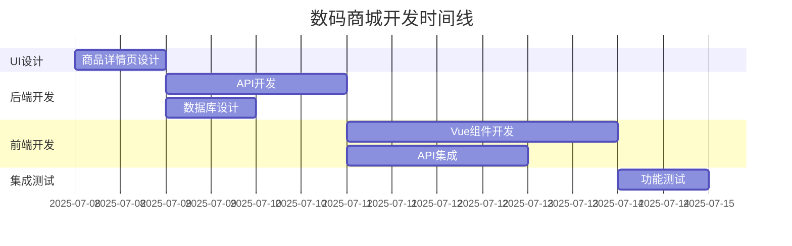

# 📊 数码商城项目管理仪表板

## 🎯 项目概览
- **项目名称**: 数码商城核心功能开发
- **开始时间**: 2025-07-08
- **预计完成**: 2025-07-15 (7天)
- **团队规模**: 4个Agent
- **当前状态**: 🟢 进行中

## 👥 团队状态

| Agent | 状态 | 当前任务 | 进度 | 预计完成 |
|-------|------|----------|------|----------|
| 🎨 UI-Agent | 🟢 进行中 | 商品详情页设计 | 0% | Day 1 |
| 🔧 Backend-Agent | ⏳ 等待 | API开发 | 0% | Day 3 |
| 🎨 Frontend-Agent | ⏳ 等待 | Vue组件开发 | 0% | Day 6 |
| 👨‍💼 总指挥 | 🟢 管理中 | 项目协调 | 20% | Day 7 |

## 📋 任务进度跟踪

### 🎨 UI-Agent 任务 (UI-001)
**状态**: 🟢 进行中  
**优先级**: 🔴 高  
**进度**: 0%

#### 子任务清单
- [ ] 桌面端布局设计
- [ ] 移动端响应式设计
- [ ] 交互状态定义
- [ ] Tailwind类名规范
- [ ] HTML结构文档

**最新更新**: 任务已分发，等待Agent确认

---

### 🔧 Backend-Agent 任务 (BE-001)
**状态**: ⏳ 等待UI-Agent完成  
**优先级**: 🔴 高  
**进度**: 0%

#### 子任务清单
- [ ] 商品API增强
- [ ] 用户认证系统
- [ ] 购物车系统优化
- [ ] 订单系统开发
- [ ] 数据库设计
- [ ] API文档生成

**依赖**: 等待UI-Agent设计完成

---

### 🎨 Frontend-Agent 任务 (FE-001)
**状态**: ⏳ 等待前置任务  
**优先级**: 🟡 中  
**进度**: 0%

#### 子任务清单
- [ ] HomePage.vue 首页组件
- [ ] ProductDetail.vue 商品详情
- [ ] AuthPage.vue 登录注册
- [ ] CartPage.vue 购物车
- [ ] API集成
- [ ] 状态管理

**依赖**: 等待UI-Agent + Backend-Agent完成

## 📅 时间线规划

## 🔄 每日站会记录

### Day 1 - 2025-07-08
**会议时间**: 项目启动  
**参会人员**: 全体Agent

#### 今日目标
- [x] 项目启动和任务分发
- [ ] UI-Agent完成商品详情页设计
- [ ] Backend-Agent准备开发环境

#### 决策事项
1. UI-Agent优先开始，其他Agent等待
2. 采用Tailwind CSS + Vue3技术栈
3. API采用RESTful设计规范

#### 风险提醒
- UI设计延期会影响整体进度
- 需要确保API设计的前后端一致性

---

## 🚨 风险监控

### 当前风险
| 风险类型 | 风险等级 | 描述 | 应对措施 |
|---------|---------|------|----------|
| 进度风险 | 🟡 中 | UI-Agent任务紧急 | 密切跟踪，必要时简化设计 |
| 技术风险 | 🟢 低 | 技术栈成熟稳定 | 提前准备技术方案 |
| 协作风险 | 🟡 中 | 远程协作沟通 | 标准化沟通流程 |

### 应急预案
1. **UI设计延期**: 使用现有设计规范，Frontend-Agent先开始基础组件
2. **API开发延期**: 使用Mock数据，前端先行开发
3. **前端开发延期**: 优先完成核心功能，次要功能后续迭代

## 📞 沟通渠道

### 紧急联系
- **项目总指挥**: 随时响应
- **技术问题**: 立即反馈
- **进度延期**: 提前24小时通知

### 汇报机制
- **每日进度**: 每天18:00前更新
- **问题反馈**: 遇到问题立即汇报
- **里程碑**: 完成任务立即通知

## 📈 质量标准

### 代码质量
- **UI设计**: 可实现性 + 用户体验
- **后端API**: 性能 + 安全性 + 文档完整
- **前端组件**: 响应式 + 可维护性 + 用户体验

### 交付标准
- **功能完整**: 100%需求覆盖
- **测试通过**: 核心功能无bug
- **文档齐全**: 使用说明 + API文档
- **代码规范**: 统一编码风格

---

## 🎯 下一步行动

### 立即执行
1. **UI-Agent**: 立即开始商品详情页设计
2. **Backend-Agent**: 准备开发环境，等待UI完成
3. **Frontend-Agent**: 准备开发环境，等待前置任务

### 今日目标
- UI-Agent完成设计规范 (100%)
- Backend-Agent环境准备 (100%)
- 项目管理流程建立 (100%)

---

**📢 重要提醒**: 所有Agent请及时查看任务文件并确认收到！

**当前最高优先级**: 🎨 UI-Agent 商品详情页设计

**项目成功关键**: 按时交付 + 质量保证 + 团队协作
